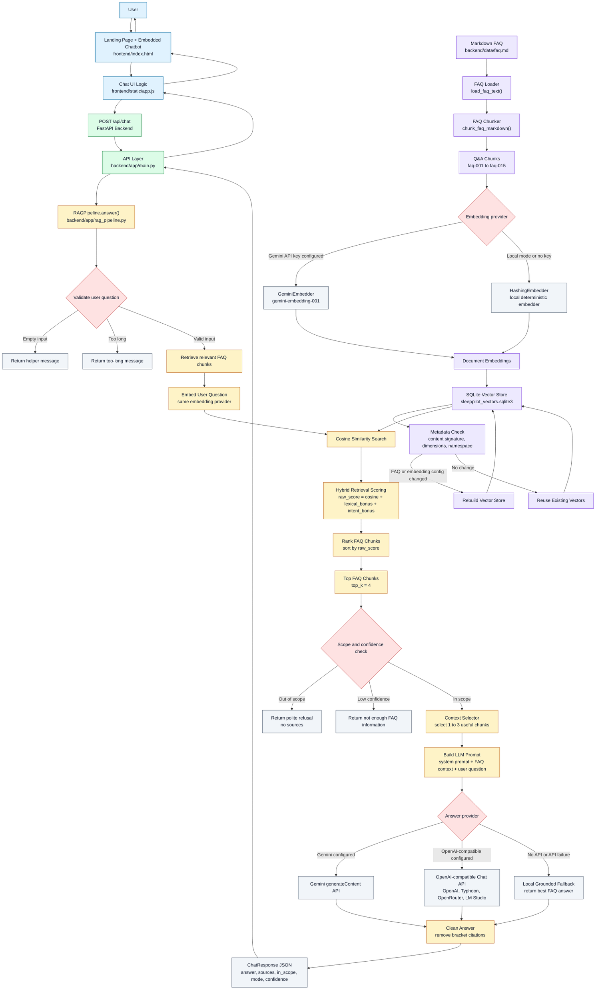

# SleepPilot RAG Chatbot

SleepPilot is a fictional sleep optimization app with the tagline:

> Smarter nights. Sharper days.

This project is a clean landing page with an embedded FAQ chatbot. The chatbot uses a retrieval-augmented generation pipeline over a small SleepPilot FAQ so answers stay grounded in product information instead of behaving like a general-purpose assistant.

The project was built for the Venture Engineering Intern assignment. It includes the landing page, FAQ knowledge base, chunking, embeddings, a lightweight vector database, retrieval, guardrails, unit tests, integration tests, and setup documentation.

## Product Summary

SleepPilot helps users understand sleep patterns, build healthier bedtime routines, and receive personalized sleep guidance using sleep logs, optional wearable data, and lifestyle inputs.

The assistant is called **SleepPilot Coach**. It answers questions about SleepPilot features, privacy, pricing, wearable integrations, smart alarm support, jet lag support, sleep scores, and bedtime routine guidance.

## Main Features

- Landing page served by FastAPI
- Embedded FAQ chatbot UI
- 15 SleepPilot FAQ Q&A pairs
- Markdown FAQ loader and Q&A chunker
- Optional Gemini embeddings for retrieval
- Local deterministic hashing embedder for no-key development and tests
- SQLite vector store for lightweight persistence
- Hybrid retrieval using vector similarity, lexical overlap, entity boosts, and intent rules
- Gemini or OpenAI-compatible LLM answer generation when configured
- Local grounded fallback when no LLM API key is available
- Guardrails for out-of-scope questions
- Unit tests for chunking, embeddings, retrieval, and guardrails
- FastAPI integration tests for `/api/chat`

## System Architecture


The system starts from a static landing page with an embedded chatbot. When the user sends a question, the frontend calls the FastAPI `/api/chat` endpoint. The backend passes the question into `RAGPipeline.answer()`, which validates the input, retrieves relevant SleepPilot FAQ chunks from the SQLite vector store, applies guardrails, selects useful context, and generates a grounded answer.

The FAQ knowledge base is stored in `backend/data/faq.md`. Each FAQ question and answer pair is loaded and converted into a chunk. The chunks are embedded using either Gemini embeddings or the local `HashingEmbedder`, depending on environment configuration. The resulting vectors are stored in SQLite with metadata so the vector store can be reused or rebuilt when the FAQ content or embedding configuration changes.

At query time, the user question is embedded with the same embedding provider used for the FAQ chunks. The retriever calculates a hybrid score using vector cosine similarity, lexical keyword overlap, and intent-based rules. The top chunks are passed through scope checks and context selection before being sent to the answer provider. If Gemini or an OpenAI-compatible API is configured, the selected FAQ context is passed to the LLM. If no external API is available, the system falls back to a local grounded answer using the best retrieved FAQ chunk.
## Project Structure

```text
.
├── backend
│   ├── app
│   │   ├── __init__.py
│   │   ├── embeddings.py
│   │   ├── faq_loader.py
│   │   ├── llm_client.py
│   │   ├── main.py
│   │   ├── rag_pipeline.py
│   │   └── vector_store.py
│   ├── data
│   │   └── faq.md
│   ├── tests
│   │   ├── test_api.py
│   │   ├── test_embeddings.py
│   │   ├── test_faq_loader.py
│   │   └── test_rag_pipeline.py
│   ├── .env.example
│   ├── pytest.ini
│   └── requirements.txt
├── frontend
│   ├── index.html
│   └── static
│       ├── app.js
│       ├── favicon.png
│       ├── sleeppilot-hero.png
│       └── styles.css
├── .gitignore
└── README.md
```


## Installation Guide

This project is designed to run locally. Deployment is optional.

### Requirements

- Python 3.11 or newer
- pip
- Optional: Gemini API key if you want hosted embeddings or hosted answer generation

No Node.js installation is required because the frontend is plain HTML, CSS, and JavaScript served by FastAPI.

### 1. Clone or unzip the project

```bash
git clone <your-repo-url>
cd EndToEndRAG
```

Or, if using a zip file:

```bash
unzip EndToEndRAG.zip
cd EndToEndRAG
```

### 2. Create a virtual environment

Linux/macOS:

```bash
cd backend
python3 -m venv .venv
source .venv/bin/activate
```

Windows PowerShell:

```powershell
cd backend
python -m venv .venv
.\.venv\Scripts\Activate.ps1
```

Windows Command Prompt:

```cmd
cd backend
python -m venv .venv
.venv\Scripts\activate.bat
```

### 3. Install dependencies

From inside the `backend` folder with the virtual environment activated:

```bash
pip install -r requirements.txt
```

### 4. Configure environment variables

Copy the example environment file:

Linux/macOS:

```bash
cp .env.example .env
```

Windows PowerShell:

```powershell
Copy-Item .env.example .env
```

You have two setup options.

#### Option A: Local mode with no API key

Use this for testing, grading, and offline demos.

In `backend/.env`:

```env
LLM_PROVIDER=local
EMBEDDING_PROVIDER=local
GEMINI_API_KEY=
```

This uses the local hashing embedder and local grounded fallback answers. No external API calls are required.

#### Option B: Gemini mode

Use this if you want hosted Gemini embeddings and Gemini answer generation.

In `backend/.env`:

```env
LLM_PROVIDER=gemini
GEMINI_MODEL=gemini-2.5-flash-lite
GEMINI_API_KEY=your_key_here

EMBEDDING_PROVIDER=gemini
GEMINI_EMBEDDING_MODEL=gemini-embedding-001
GEMINI_EMBEDDING_DIMENSIONS=768
```

The first request may take longer because the app builds the SQLite vector store by embedding all FAQ chunks.

#### Option C: OpenAI-compatible answer model

Use this if you want the answer generation step to call Typhoon, OpenAI, OpenRouter, LM Studio, Ollama-compatible endpoints, or another chat-completions-compatible API.

In `backend/.env`:

```env
LLM_PROVIDER=openai-compatible
LLM_API_KEY=your_key_here
LLM_BASE_URL=https://api.opentyphoon.ai/v1
OPENAI_COMPATIBLE_MODEL=typhoon-v2.1-12b-instruct

EMBEDDING_PROVIDER=local
```

You can also set `EMBEDDING_PROVIDER=gemini` if you have a Gemini API key and want Gemini retrieval embeddings.

### 5. Run the app

From inside the `backend` folder with the virtual environment activated:

```bash
uvicorn app.main:app --reload
```

Open:

```text
http://127.0.0.1:8000
```

The FastAPI backend serves the frontend page directly, so you only need one command.


## How The Project Works

### 1. Frontend

The frontend is a static landing page in `frontend/index.html`. It contains the SleepPilot product hero, feature cards, privacy section, FAQ topic strip, and embedded chatbot.

The JavaScript file `frontend/static/app.js` handles the chat interaction. When the user submits a question, it sends a request to:

```text
POST /api/chat
```

with this body:

```json
{
  "question": "Does SleepPilot support Garmin?"
}
```

The frontend then displays the returned answer, source badges, and answer mode such as `local-rag` or `gemini:gemini-2.5-flash-lite`.

### 2. Backend API

The backend is a FastAPI app in `backend/app/main.py`. It serves both the landing page and the RAG API.

Main routes:

```text
GET  /
GET  /api/health
GET  /api/faq/chunks
GET  /api/retrieve?question=...
POST /api/chat
```

`GET /` returns the landing page. `POST /api/chat` is the main chatbot route. It creates or reuses one `RAGPipeline` instance and sends the user question into the RAG flow.

### 3. FAQ Knowledge Base

The knowledge base is:

```text
backend/data/faq.md
```

It contains 15 Q&A pairs about SleepPilot. This is the source of truth for the assistant.

The loader in `backend/app/faq_loader.py` reads the markdown file and splits sections that look like this:

```md
## 1. What is SleepPilot?
SleepPilot is a sleep optimization app...
```

Each Q&A pair becomes one chunk:

```python
{
    "id": "faq-001",
    "question": "What is SleepPilot?",
    "answer": "SleepPilot is a sleep optimization app...",
    "text": "Question: What is SleepPilot?\nAnswer: SleepPilot is a sleep optimization app..."
}
```

This project uses one Q&A pair per chunk because the FAQ is small and naturally structured. That keeps retrieval simple and makes source display clear.

### 4. Embeddings

Embeddings are handled in `backend/app/embeddings.py`.

The project supports two embedding providers:

1. `GeminiEmbedder`
2. `HashingEmbedder`

The selected provider is controlled by environment variables:

```text
EMBEDDING_PROVIDER=gemini
GEMINI_API_KEY=your_key_here
```

If `EMBEDDING_PROVIDER=gemini` and a Gemini key exists, the app uses Gemini `gemini-embedding-001`. If no Gemini key is available, or if `EMBEDDING_PROVIDER=local`, it uses the local `HashingEmbedder`.

Important detail: the vector store stores only one embedding set at a time. It does not store Gemini vectors and local hashing vectors together. The SQLite table has one `embedding` column per chunk. If the embedding provider, embedding dimension, embedding namespace, FAQ content, or retrieval hints change, the vector store is rebuilt.

### 5. Local Hashing Embedder

The local `HashingEmbedder` is used for reliable tests and no-key demos. It works like this:

```text
input text
↓
lowercase
↓
add special phrase tokens such as jet_lag, apple_health, sleep_score
↓
remove stopwords before normalization
↓
normalize words such as wearables → wearable
↓
add normal word features
↓
add bigram features with higher weight
↓
add domain synonym features with lower weight
↓
hash features into a fixed-size vector
↓
normalize the vector
```

The current local vector size is 384 dimensions.

Phrase tokens help the simple embedder understand SleepPilot concepts. For example:

```text
jet lag       → jet_lag
Apple Health  → apple_health
sleep score   → sleep_score
smart alarm   → smart_alarm
```

Stopwords are removed before word normalization so words like `does` do not accidentally become `doe` and stay in the token list.

### 6. Gemini Embedder

`GeminiEmbedder` calls the Gemini embedding endpoint. It uses:

```text
gemini-embedding-001
```

by default, with 768 output dimensions unless changed in `.env`.

The app uses different task types for documents and queries:

```text
RETRIEVAL_DOCUMENT for FAQ chunks
RETRIEVAL_QUERY for user questions
```

This helps the embedding model optimize vectors for retrieval.

### 7. SQLite Vector Store

The vector database is implemented in `backend/app/vector_store.py` as `SQLiteVectorStore`.

The generated database path is:

```text
backend/data/sleeppilot_vectors.sqlite3
```

The database has two tables:

```text
chunks
metadata
```

`chunks` stores:

```text
id
question
answer
text
embedding
```

`metadata` stores:

```text
content_signature
embedding_dimensions
embedding_namespace
chunk_count
```

The metadata lets the app decide whether the stored vectors are still valid. If the FAQ content, retrieval hints, embedding dimensions, or embedding namespace changed, the old vectors are deleted and rebuilt.

The SQLite file is generated automatically. It does not need to be committed or included in the submission zip.

### 8. Retrieval Hints

Each FAQ chunk also has hidden retrieval hints in `FAQ_SEARCH_HINTS` inside `vector_store.py`.

For example:

```python
"faq-006": "wearable support integrations Apple Health Google Fit Fitbit Garmin device permissions"
```

These hints are added only to the embedded retrieval text. They do not change the public FAQ answer. They help the retriever understand likely user wording, such as `Garmin`, `Fitbit`, `Google Fit`, or `Apple Health`.

The embedded document text is:

```text
Question + Answer + Retrieval hints
```

### 9. Hybrid Retrieval Score

The retriever does not use pure vector similarity only. It calculates a hybrid score:

```text
raw_score = cosine_similarity + lexical_bonus + intent_bonus
```

Then it creates a clamped display score:

```text
display_score = clamp(raw_score, 0.0, 1.0)
```

The important part is that ranking uses `raw_score`, not the clamped display score. This prevents different chunks with scores above 1.0 from becoming tied after clamping.

The displayed source confidence uses the clamped score because it is easier to show in the UI as a value from 0% to 100%.

### 10. Cosine Similarity

The user question is embedded using the same embedder as the FAQ chunks. Then the retriever compares the query vector with every stored chunk vector using cosine similarity.

```text
cosine_similarity = dot(query_vector, chunk_vector) / (query_norm × chunk_norm)
```

A higher value means the question is more similar to that FAQ chunk.

### 11. Lexical Bonus

The lexical bonus rewards exact overlap between query tokens and chunk tokens.

The code expands user tokens using domain synonyms, then checks overlap with each chunk.

Example:

```text
cost → price, pricing, plan, premium, free
wearable → device, fitbit, garmin, apple, google, integration
```

The lexical bonus uses an IDF-like formula:

```text
token_score = 1 + log((document_count + 1) / (document_frequency[token] + 1))
```

Rare matching words are more useful than common matching words.

Then it adds an entity bonus for important terms such as:

```text
garmin
fitbit
privacy
premium
jet_lag
smart_alarm
wearable
```

The final lexical bonus is capped at 0.28 so keyword overlap helps retrieval without overpowering vector similarity and intent rules.

### 12. Intent Bonus

The intent bonus handles cases where a small FAQ retriever can confuse similar topics.

For example, both of these questions contain `wearable`, but they mean different things:

```text
Can I use SleepPilot without a wearable?
Does SleepPilot support Garmin or Fitbit?
```

The code gives a strong bonus to:

```text
faq-005 for without-wearable questions
faq-006 for supported-wearable questions
```

It also boosts known intent phrases such as:

```text
what is this thing       → faq-001
improve my sleep         → faq-002
when to go to bed        → faq-011
sleep too late           → faq-013
what data does it collect → faq-004
protect my privacy       → faq-007
```

It can also apply a small negative penalty when a chunk is likely wrong, such as preventing bedtime planning questions from accidentally retrieving the sleep score chunk.

### 13. Context Selection

The vector store returns the top 4 results. Then `RAGPipeline._select_context_results()` chooses how many chunks to send to the LLM.

Rules:

```text
Always include the best chunk.
Include more chunks only if their scores are close enough.
Use at most 3 chunks as LLM context.
```

This keeps the answer grounded without sending too much irrelevant text.

### 14. Guardrails

Guardrails are implemented in `backend/app/rag_pipeline.py`.

The assistant accepts questions related to SleepPilot, sleep, privacy, pricing, wearables, alarms, travel, students, jet lag, sleep scores, and bedtime routines.

It declines unrelated topics such as:

```text
coding
weather
politics
stocks
recipes
homework
movies
sports
```

If the question is unrelated, the system returns a decline message before generating an LLM answer.

If the question seems in-scope but the retrieved score is too low, the system returns an unknown answer instead of hallucinating.

### 15. Answer Generation

Answer generation happens in `RAGPipeline._generate_answer()`.

The selected FAQ chunks are formatted like this:

```text
[1] faq-006 (score 0.912)
Q: Which wearable devices does SleepPilot support?
A: SleepPilot is designed to support common wearable platforms...
```

The system prompt tells the LLM:

```text
You are SleepPilot Coach.
Only answer SleepPilot-related questions.
Use only the provided FAQ context.
Politely decline unrelated requests.
SleepPilot is wellness guidance, not a medical device.
```

The answer provider is selected in this order:

1. Gemini, if `LLM_PROVIDER=gemini` and `GEMINI_API_KEY` is configured
2. OpenAI-compatible API, if `LLM_PROVIDER=openai-compatible` or `LLM_PROVIDER=api`
3. Local grounded fallback if no API is configured or the API call fails

The local fallback returns the best retrieved FAQ answer directly. This keeps the project runnable without an API key.

### 16. Source Display

The API response includes sources:

```json
{
  "answer": "...",
  "sources": [
    {
      "id": "faq-006",
      "question": "Which wearable devices does SleepPilot support?",
      "answer": "...",
      "score": 0.92
    }
  ],
  "in_scope": true,
  "mode": "local-rag",
  "confidence": 0.92
}
```

The frontend displays each source as a badge, such as:

```text
faq-006 - 92%
```

The answer cleaner removes accidental bracket citations like `[1]` or `[2]`, because the UI already displays sources separately.

## File-by-File Explanation

### `backend/app/faq_loader.py`

Loads the markdown FAQ file and splits it into Q&A chunks. It is responsible for turning `faq.md` into RAG-ready data.

Main functions:

```text
load_faq_text()
chunk_faq_markdown()
load_and_chunk_faq()
```

### `backend/app/embeddings.py`

Defines the embedding interface and embedding implementations.

Important parts:

```text
HashingEmbedder
GeminiEmbedder
tokenize()
normalize_token()
expand_tokens()
cosine_similarity()
create_default_embedder()
```

This file decides whether retrieval uses Gemini embeddings or the local hashing embedder.

### `backend/app/vector_store.py`

Implements the lightweight vector database using SQLite. It stores FAQ chunks and embeddings, rebuilds vectors when needed, and retrieves relevant chunks.

Important parts:

```text
SQLiteVectorStore
StoredChunk
SearchResult
FAQ_SEARCH_HINTS
INTENT_RULES
similarity_search()
_lexical_bonus()
_intent_bonus()
```

This file is the core retrieval engine.

### `backend/app/rag_pipeline.py`

Orchestrates the full RAG process. It loads the FAQ, ensures the vector store exists, runs retrieval, applies guardrails, selects context, calls the LLM or fallback, cleans the answer, and returns sources.

Important parts:

```text
RAGPipeline
ChatResult
ChatSource
SYSTEM_PROMPT
DECLINE_MESSAGE
UNKNOWN_MESSAGE
answer()
_select_context_results()
_generate_answer()
_is_out_of_scope()
```

### `backend/app/llm_client.py`

Contains API clients for answer generation.

Important classes:

```text
GeminiClient
OpenAICompatibleClient
LLMResponse
```

`GeminiClient` calls Gemini `generateContent`. `OpenAICompatibleClient` supports Typhoon, OpenAI, OpenRouter, LM Studio, Ollama-compatible routers, or other chat-completions-compatible APIs.

### `backend/app/main.py`

Creates the FastAPI application. It serves the frontend and exposes API routes for health checks, FAQ chunk inspection, retrieval debugging, and chat.

Important routes:

```text
GET  /
GET  /api/health
GET  /api/faq/chunks
GET  /api/retrieve
POST /api/chat
```

### `backend/data/faq.md`

The SleepPilot knowledge base. It contains 15 FAQ Q&A pairs and is the only product knowledge source used by the RAG assistant.

### `backend/tests/test_faq_loader.py`

Tests that the FAQ file loads correctly and is split into 15 usable chunks.

### `backend/tests/test_embeddings.py`

Tests that the local hashing embedder is deterministic, returns the correct vector size, normalizes vectors, and recognizes domain phrase tokens such as `jet_lag` and `apple_health`.

### `backend/tests/test_rag_pipeline.py`

Tests retrieval and RAG behavior. It checks that many different user questions retrieve the correct FAQ chunk, that similar questions like wearable support versus no-wearable usage are separated, that in-scope questions get answers, and that out-of-scope requests are declined.

### `backend/tests/test_api.py`

Tests the FastAPI `/api/chat` endpoint using `TestClient`. These tests check that the API returns grounded answers for in-scope questions and applies guardrails for unrelated questions.

### `frontend/index.html`

The landing page and chatbot shell. It contains the product content and chat interface.

### `frontend/static/app.js`

Controls frontend chat behavior. It sends user questions to `/api/chat`, displays answers, shows source badges, updates answer mode, and checks API health.

### `frontend/static/styles.css`

Styles the landing page, product sections, chatbot, messages, source badges, and responsive layout.

## API Usage

### Health check

```bash
curl http://127.0.0.1:8000/api/health
```

Example response:

```json
{
  "status": "ok",
  "product": "SleepPilot",
  "faq_chunks": 15,
  "embedding_provider": "sleeppilot-v4",
  "embedding_dimensions": "384",
  "vector_db": ".../backend/data/sleeppilot_vectors.sqlite3"
}
```

### Inspect FAQ chunks

```bash
curl http://127.0.0.1:8000/api/faq/chunks
```

### Debug retrieval

```bash
curl "http://127.0.0.1:8000/api/retrieve?question=Does%20SleepPilot%20support%20Garmin%3F"
```

### Chat request

```bash
curl -X POST http://127.0.0.1:8000/api/chat \
  -H "Content-Type: application/json" \
  -d '{"question":"Does SleepPilot work without a wearable device?"}'
```

## Running Tests

From inside the `backend` folder with the virtual environment activated:

```bash
pytest
```

The tests force local mode using `monkeypatch`, so they do not need an API key.

Current test coverage includes:

- FAQ loading
- FAQ chunking
- Local embedding determinism
- Domain phrase tokenization
- Vector retrieval ranking
- Similar-topic distinction, such as Garmin/Fitbit support versus no-wearable usage
- In-scope RAG answer behavior
- Context selection
- Citation cleanup
- Out-of-scope guardrails
- FastAPI `/api/chat` integration path

## Manual Test Cases

| Scenario | Question | Expected behavior |
| --- | --- | --- |
| In-scope FAQ | Does SleepPilot work with Garmin or Fitbit? | Retrieves `faq-006` and answers from wearable integrations. |
| In-scope no-wearable case | Can I use SleepPilot without a wearable? | Retrieves `faq-005` and explains manual entry support. |
| Wellness boundary | Does SleepPilot diagnose sleep disorders? | Explains SleepPilot is not a medical device and suggests professional care for concerning symptoms. |
| Privacy | How does SleepPilot protect my privacy? | Retrieves the privacy FAQ and explains user control and data deletion. |
| Out of scope | Write Python code for a todo app. | Politely declines and redirects to SleepPilot topics. |
| Edge case | What if SleepPilot cannot answer my question? | Explains that the assistant only answers from available FAQ/product information. |
| Missing LLM key | Ask any in-scope question with local mode enabled. | Returns a grounded local answer with FAQ sources. |

## Tools Used

- Python
- FastAPI
- Pydantic
- SQLite
- Requests
- Pytest
- Plain HTML, CSS, and JavaScript
- Gemini API for optional hosted embeddings and answer generation
- OpenAI-compatible chat-completions API support for optional alternative LLMs
- Local deterministic hashing embedder for tests and no-key development


## Troubleshooting

### `ModuleNotFoundError: No module named 'app'`

Run commands from inside the `backend` folder. The project includes `backend/pytest.ini` with:

```ini
[pytest]
pythonpath = .
testpaths = tests
```

So this should work:

```bash
cd backend
pytest
```

### The first request is slow

If you use Gemini embeddings, the first request may build the vector database by embedding all FAQ chunks. After that, the SQLite vector store is reused.

### Retrieval seems outdated after changing embeddings

Delete the generated SQLite file:

```bash
rm backend/data/sleeppilot_vectors.sqlite3
```

or change the embedder namespace if the embedding logic changed. The current local hashing namespace is:

```text
sleeppilot-v4
```

### The frontend says API offline

Make sure the backend is running:

```bash
cd backend
source .venv/bin/activate
uvicorn app.main:app --reload
```

Then open:

```text
http://127.0.0.1:8000
```
