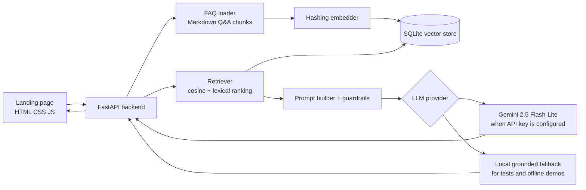

# SleepPilot RAG Chatbot

SleepPilot is a fictional sleep optimization app with the tagline:

> Smarter nights. Sharper days.

This project is a landing page with an embedded FAQ chatbot. The chatbot uses a
minimal RAG pipeline over the SleepPilot FAQ so answers stay grounded in product
information instead of becoming a general-purpose assistant.

## Product

SleepPilot helps users understand their sleep patterns, build healthier routines,
and receive personalized bedtime recommendations using sleep logs, wearable data,
and lifestyle inputs.

## Architecture



## Project Structure

```text
.
├── backend
│   ├── app
│   │   ├── embeddings.py
│   │   ├── faq_loader.py
│   │   ├── llm_client.py
│   │   ├── main.py
│   │   ├── rag_pipeline.py
│   │   └── vector_store.py
│   ├── data
│   │   └── faq.md
│   ├── tests
│   ├── .env.example
│   ├── pytest.ini
│   └── requirements.txt
├── frontend
│   ├── index.html
│   └── static
│       ├── app.js
│       ├── sleeppilot-hero.png
│       └── styles.css
└── README.md
```

## Setup

From the repo root:

```bash
source ../.venv/bin/activate
pip install -r backend/requirements.txt
```

Create `backend/.env` from `backend/.env.example` and add your Gemini key:

```bash
LLM_PROVIDER=gemini
GEMINI_MODEL=gemini-2.5-flash-lite
GEMINI_API_KEY=your_key_here
```

`backend/.env` is ignored by git. Do not commit real API keys. If no Gemini key
is configured, the app still works through the local grounded fallback so tests
and demos remain reliable.

## Run

From the repo root:

```bash
source ../.venv/bin/activate
cd backend
uvicorn app.main:app --reload
```

Open:

```text
http://127.0.0.1:8000
```

Useful API routes:

```text
GET  /api/health
GET  /api/faq/chunks
GET  /api/retrieve?question=Does SleepPilot support Garmin?
POST /api/chat
```

Example chat request:

```bash
curl -X POST http://127.0.0.1:8000/api/chat \
  -H "Content-Type: application/json" \
  -d '{"question":"Does SleepPilot work without a wearable device?"}'
```

## Test

From the repo root:

```bash
source ../.venv/bin/activate
cd backend
pytest
```

Current coverage includes:

- FAQ loading and chunk parsing
- deterministic embedding behavior
- vector retrieval ranking
- in-scope RAG response generation
- out-of-scope guardrails
- FastAPI `/api/chat` integration path

## RAG Approach

The knowledge base is `backend/data/faq.md`, which contains 15 SleepPilot FAQ
Q&A pairs.

Chunking:

- The FAQ loader splits markdown sections like `## 1. Question?`.
- Each Q&A pair becomes one retrieval chunk with `id`, `question`, `answer`, and
  combined `text`.
- One Q&A per chunk keeps answers easy to cite and avoids mixing unrelated FAQ
  topics.

Embeddings:

- `HashingEmbedder` creates deterministic local vectors from tokens, phrase
  tokens, bigrams, and small SleepPilot domain synonym expansions.
- Each FAQ chunk also has hidden retrieval hints such as `jet lag`, `sleep
  score`, `go to bed`, or `Fitbit/Garmin` so similar SleepPilot wording stays
  separated without making the public FAQ awkward.
- This avoids requiring a paid embedding call during tests.
- The hosted LLM is used for answer wording when configured, while retrieval
  remains local and reproducible.

Vector database:

- `SQLiteVectorStore` persists chunks and embeddings in
  `backend/data/sleeppilot_vectors.sqlite3`.
- Similarity search uses a hybrid score: cosine similarity, IDF-style lexical
  overlap, product/entity boosts, and a few intent rules for ambiguous phrases
  like "what is this thing" or "when to go to bed".
- The DB is rebuilt automatically when the FAQ content or retrieval hints
  change.

Answer generation:

- Guardrails run before answer generation.
- In-scope questions retrieve candidates, rerank them, and pass up to the top 3
  useful chunks to the LLM.
- The response cleaner removes accidental bracket citations such as `[2]` so
  source badges stay in the UI instead of leaking into the answer text.
- If `GEMINI_API_KEY` is configured, the app calls Gemini
  `gemini-2.5-flash-lite`.
- If Gemini is not configured or the request fails, the app uses a local
  extractive fallback from the retrieved FAQ chunk.

## Guardrails

SleepPilot Coach only answers questions about SleepPilot, sleep tracking
features, privacy, pricing, wearable integrations, smart alarms, travel support,
and sleep routine guidance.

It politely declines unrelated requests such as coding help, weather, politics,
finance, recipes, and homework. It also states when there is not enough FAQ
context to answer confidently.

## Manual Test Cases

| Scenario | Question | Expected behavior |
| --- | --- | --- |
| In-scope FAQ | Does SleepPilot work with Garmin or Fitbit? | Answers from the wearable integrations FAQ and returns sources. |
| In-scope wellness boundary | Does SleepPilot diagnose sleep disorders? | Explains it is not a medical device and recommends professional care for concerning symptoms. |
| Out of scope | Write Python code for a todo app. | Politely declines and says it only helps with SleepPilot. |
| Edge case | What if SleepPilot cannot answer my question? | Says it does not have enough information and lists supported product areas. |
| Missing LLM key | Ask any in-scope question without `GEMINI_API_KEY`. | Still returns a grounded local answer with FAQ sources. |

## Tools And Prompts

Tools used while building:

- FastAPI for the backend API and static page serving
- SQLite for the lightweight vector store
- Pytest for unit and integration tests
- Gemini API as the optional hosted LLM answer step
- Local deterministic embeddings for reliable tests and no-key development
- Pillow once to generate the local `sleeppilot-hero.png` visual asset

Main implementation prompt:

```text
Build a landing page with an embedded FAQ chatbot for SleepPilot, a sleep
optimization app. Use a minimal RAG pipeline over the product FAQ, include
guardrails for out-of-scope questions, add unit and integration tests, and
document setup, architecture, RAG approach, and manual test cases.
```

## Future Improvement

With more time, I would add a small admin page for editing FAQ entries and
triggering a vector-store rebuild from the browser. That would make the RAG
knowledge base easier to maintain without touching markdown directly.

## Notes On Gemini

The default hosted model is `gemini-2.5-flash-lite`, selected because Google
lists it as the small cost-effective Gemini 2.5 model with free-tier standard
input and output pricing. The implementation uses the Gemini `generateContent`
REST endpoint.

References:

- Gemini pricing: https://ai.google.dev/gemini-api/docs/pricing
- Gemini models: https://ai.google.dev/gemini-api/docs/models
- `generateContent` endpoint: https://ai.google.dev/api/generate-content
